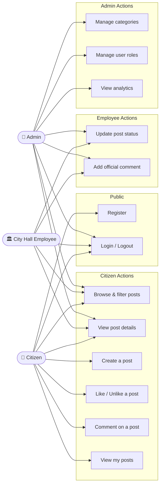
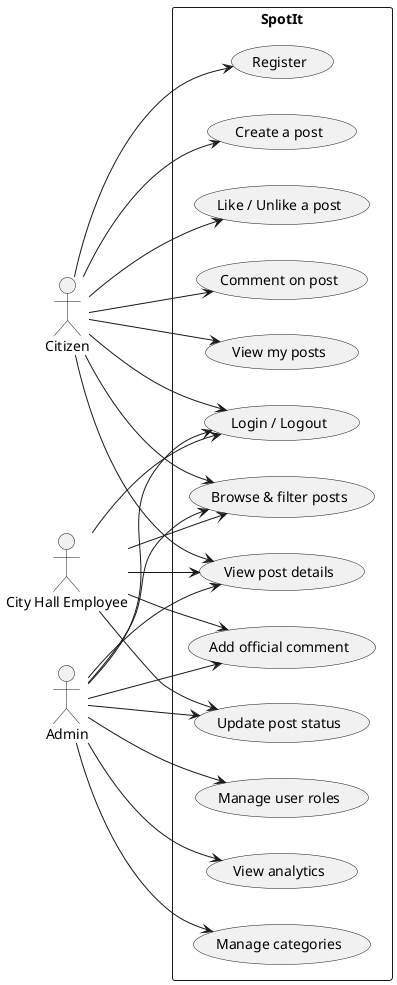
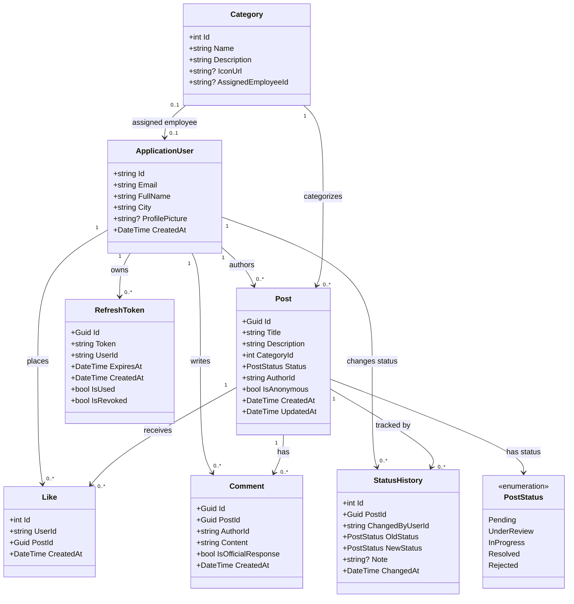
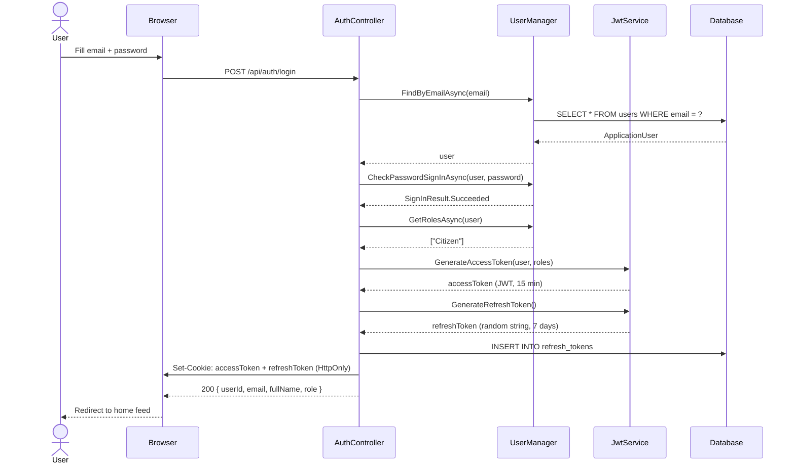
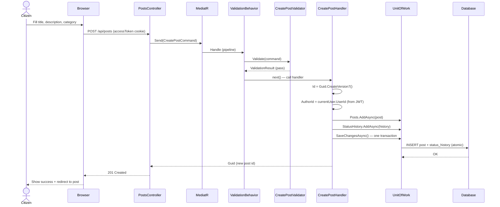
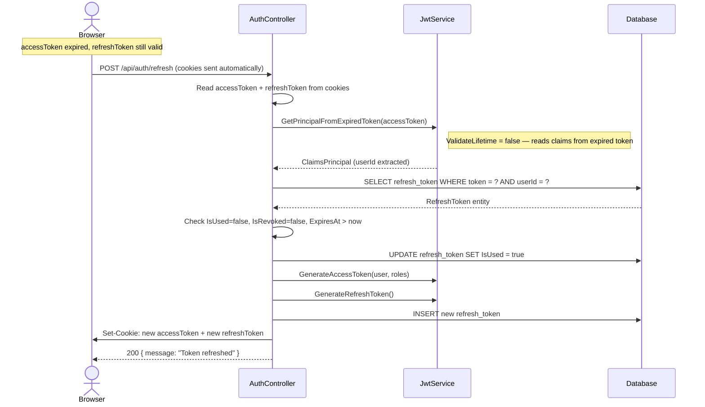
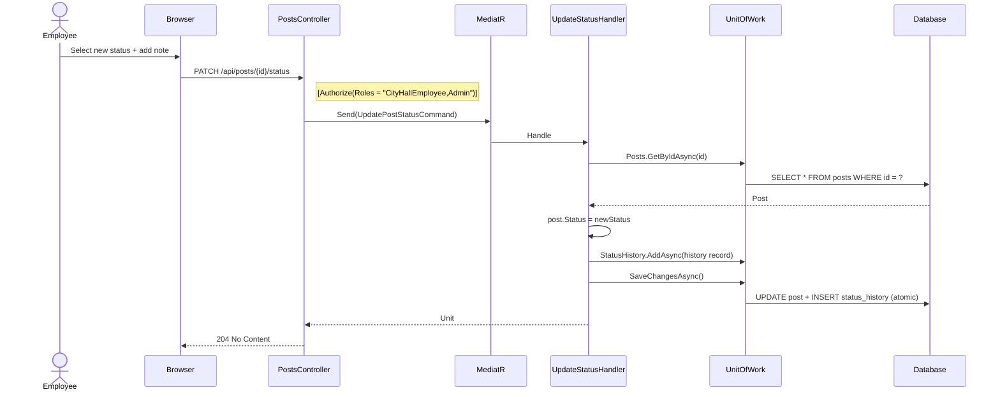
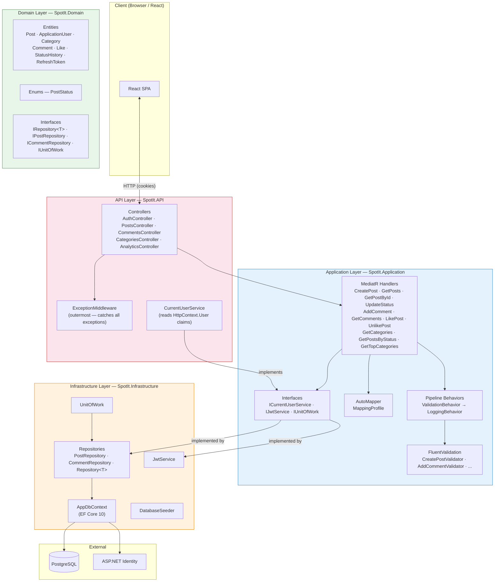
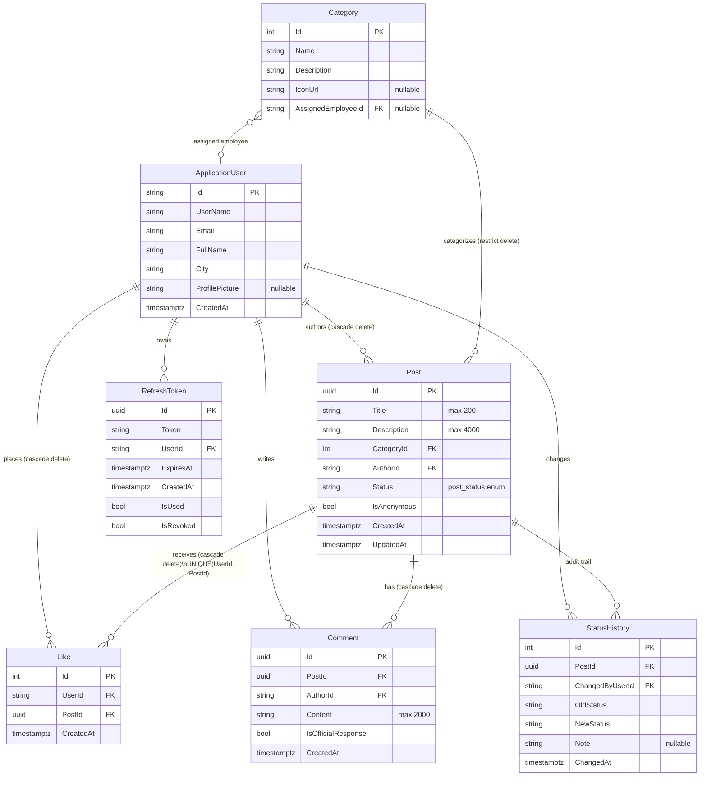
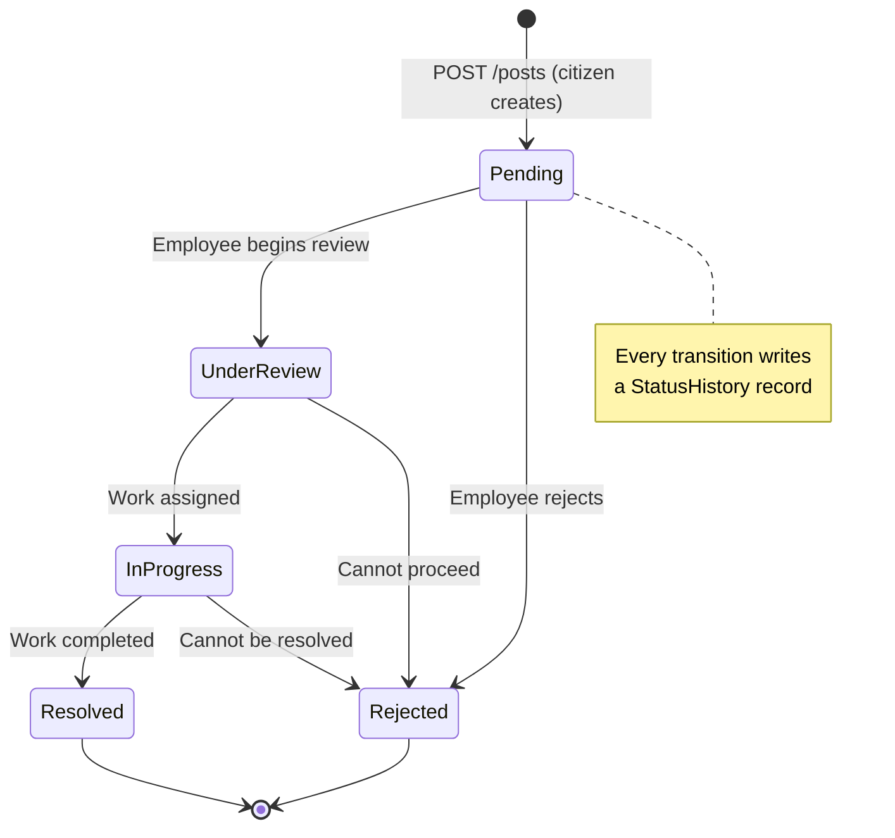

# SpotIt — System Diagrams

Rendered automatically by GitHub. For local preview: VS Code + "Markdown Preview Mermaid Support" extension.

---

## 1. Use Case Diagram

> Mermaid has no native use-case type — this uses a flowchart approximation.
> For a formal UML use-case diagram paste the PlantUML block at the bottom into plantuml.com.

PlantUML version (paste at plantuml.com for proper UML notation)

---

## 2. Class Diagram

---

## 3. Sequence Diagrams

### 3a. Login Flow

---

### 3b. Create Post Flow (with validation pipeline)

---

### 3c. Refresh Token Flow

---

### 3d. Update Post Status (Employee flow)

---

## 4. Architecture Diagram

---

## 5. Database Schema (ERD)

---

## 6. Post Status — State Machine

